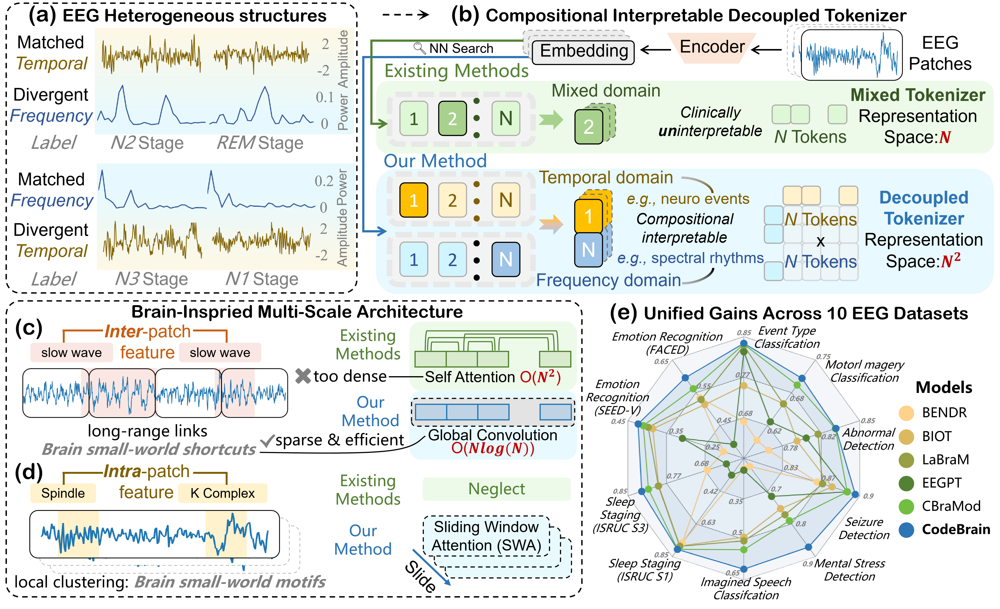
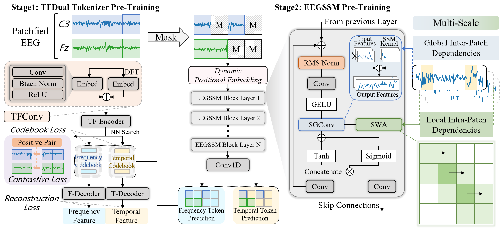
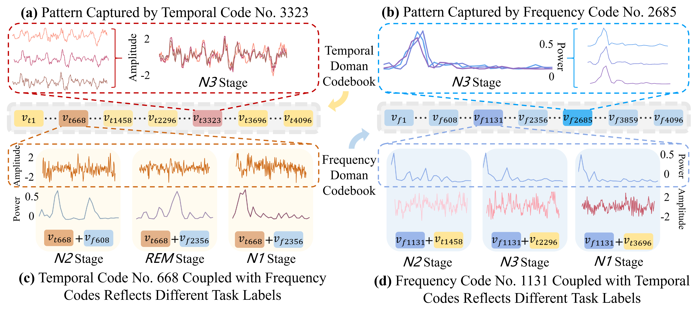

# [[ICLR 2026] CodeBrain: Bridging Decoupled Tokenizer and Multi-Scale Architecture for EEG Foundation Models](https://arxiv.org/abs/2506.09110)

This repository is the official implementation of the ICLR 2026 paper *CodeBrain: Bridging Decoupled Tokenizer and Multi-Scale Architecture for EEG Foundation Models.*

## Introduction

**CodeBrain** is a two-stage EEG foundation model designed to learn generalizable decoupled and multi-scale representations from large-scale EEG data. It consists of:

- **Stage 1**: TFDual-Tokenizer for decoupled time-frequency tokenization
- **Stage 2**: EEGSSM encoder trained via masked self-supervised learning



## Methodology



## Visualization



## Getting Started

After entering the `CodeBrain` directory, please run the following commands to ensure correct module referencing:

### Stage 1: Pretrain TFDual-Tokenizer

`python -m Pretrain.pretrain_TFDual`

### Stage 2: Pretrain EEGSSM Encoder

`python -m Pretrain.pretrain_EEGSSM`

### Fine-tuning on Downstream Tasks

To start fine-tuning, run:

`python -m Downstream.finetune_main`

## Notes

- Please make sure all required dependencies are installed.
- Paths and configurations can be adjusted in the respective training scripts.

## Acknowledgement

We gratefully acknowledge the authors of [LaBraM](https://github.com/935963004/LaBraM), [CBraMod](https://github.com/wjq-learning/CBraMod) and [SGConv](https://github.com/ctlllll/SGConv) for their open-source implementation.

## Reference

If you find this work helpful, please cite:

```bibtex
@article{ma2025codebrain,
  title={Codebrain: Bridging decoupled tokenizer and multi-scale architecture for eeg foundation model},
  author={Ma, Jingying and Wu, Feng and Lin, Qika and Xing, Yucheng and Liu, Chenyu and Jia, Ziyu and Feng, Mengling},
  journal={arXiv e-prints},
  pages={arXiv--2506},
  year={2025}
}
```